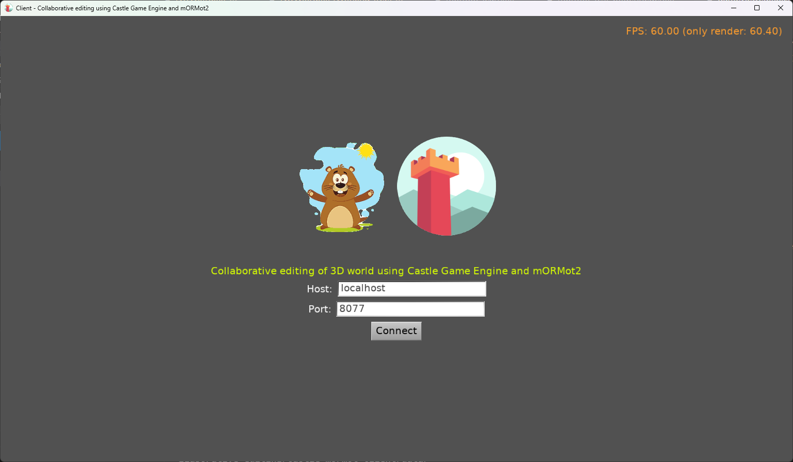
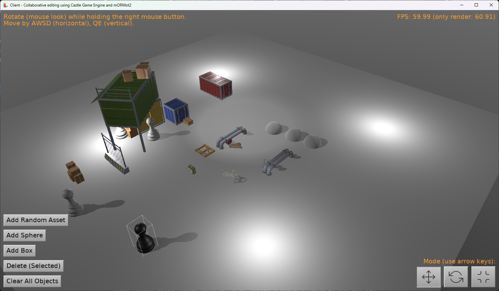

# Collaborative editing of 3D world using Castle Game Engine and mORMot2

## Introduction

A collaboration of two open-source projects, both using modern Pascal:

1. [Castle Game Engine](https://castle-engine.io/) - 3D and 2D game engine, with editor, lots of rendering features and powerful API. This provides local display and editing of the 3D world.

2. [mORMot 2](https://github.com/synopse/mORMot2/) - ORM / SOA / MVC framework. This provides the ORM -- a way to express the resulting world as objects that can be send over the the network and persisted on the server side.

In effect, you have a fun application where multiple people can connect and rearrange a 3D world. Example fun you can do:

- Design city from a buildings.
- Design a room from furniture.
- Arrange chess pieces on a board.

## Screenshots




## ORM usage

This uses ORM to synchronize the 3D world between the server and clients.

- It means that we have a class `TOrmCastleTransform` (defined in [SharedData](https://github.com/castle-engine/castle-and-mormot-collaborative-editing/blob/master/shared/shareddata.pas) unit) that represents a single 3D object in our world.

- We use mORMot to synchronize the state of this class. Client synchronizes state with server, and server synchronizes state with database (Sqlite) on disk.

- On the client side, this is also synchronized with _Castle Game Engine_ components -- one `TOrmCastleTransform` corresponds to one `TCastleTransform` (plus one child, like `TCastleScene` or `TCastleSphere` or `TCastleBox`) in the 3D world.

- ORM is a powerful approach when you want to think "I have a state of my objects, I want to synchronize it over the network". There's no need for much of application-specific server code -- the server stores the state of the objects and out-of-the-box allows the client to modify this state, by adding/updating/removing objects. So you don't need to deal with services, endpoints, JSON parsing, database reading/saving -- this is taken care of by mORMot.

- Note that this isn't the only way to use mORMot. You can also use mORMot to expose specific services (endpoints), and to implement them in any way, e.g. by database access. Just for this case, using ORM for 100% of operations made sense.

The main unit where the ORM state is visualized and manipulated is [GameViewEdit](https://github.com/castle-engine/castle-and-mormot-collaborative-editing/blob/master/castle_mormot_client/code/gameviewedit.pas).

The _mORMot_ usage in this demo follows a simple example [ex/ThirdPartyDemos/martin-doyle/02-HttpClientServerORM/](https://github.com/synopse/mORMot2/tree/master/ex/ThirdPartyDemos/martin-doyle/02-HttpClientServerORM/src). If you want to explore this approach without _Castle Game Engine_, you can start with that example.

## Building

Get [mORMot 2](https://github.com/synopse/mORMot2/). Follow the quick-start guide there. In short:

```
git clone https://github.com/synopse/mORMot2/
cd static/
  wget https://synopse.info/files/mormot2static.7z
  7z x mormot2static.7z
cd ../
lazbuild packages/lazarus/mormot2.lpk
lazbuild packages/lazarus/mormot2ui.lpk
```

If you want to build using [CGE editor](https://castle-engine.io/editor) or [CGE command-line build tool](https://castle-engine.io/build_tool), then edit these files:

- `castle_mormot_client/CastleEngineManifest.xml`
- `castle_mormot_server/CastleEngineManifest.xml`

to 1. indicate the proper (absolute or relative) directory where mORMot2 is located, 2. indicate the proper path to static files, if you compile for something else than `win64`.

NOTE: There's no need to edit the `CastleEngineManifest.xml` files if you build using Lazarus or Delphi IDEs -- in this case, if you followed the mORMot2 quick-start guide, you're all set.

Both client and server can be built just like all _Castle Game Engine_ projects:

Compile by:

- [CGE editor](https://castle-engine.io/editor). Just use menu items _"Compile"_ or _"Compile And Run"_.

- Or use [CGE command-line build tool](https://castle-engine.io/build_tool). Run `castle-engine compile` in this directory.

- Or use [Lazarus](https://www.lazarus-ide.org/). Open in Lazarus `castle_mormot_client.lpi` (or `castle_mormot_server.lpi`) file and compile / run from Lazarus. Make sure to first register [CGE Lazarus packages](https://castle-engine.io/lazarus).

- Or use [Delphi](https://www.embarcadero.com/products/Delphi). Open in Delphi `castle_mormot_client.dproj` (or `castle_mormot_server.dproj`) file and compile / run from Delphi. See [CGE and Delphi](https://castle-engine.io/delphi) documentation for details.

## TODO

- For collaborative editing, actually watch for changes from others done to the world. This is not implemented yet, we only synchronize from server at Start.
- Allow choosing specific asset to add (TCastleComboBox), not random.
- UI tiny improvement: both hover + selected handle specially.
- Show nice gizmo to move/rotate/scale objects, just like editor.

## Authors and license

Copyright 2024 by Michalis Kamburelis.

Licence: permissive 3-clause BSD license. Basically do what you want, just keep the copyright notice.
