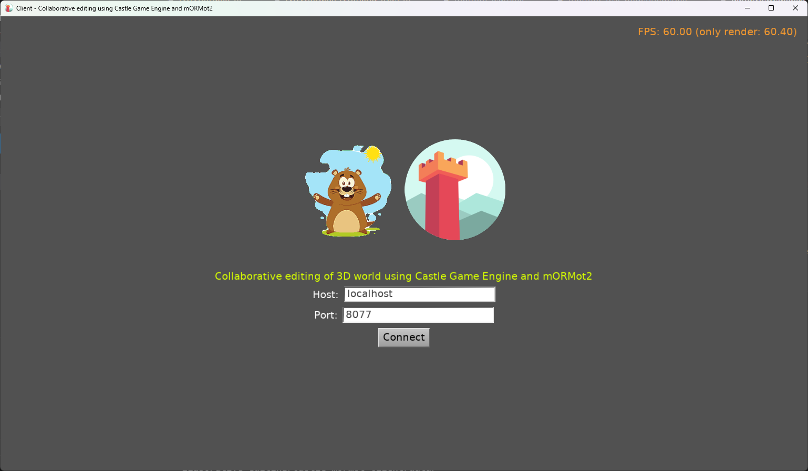
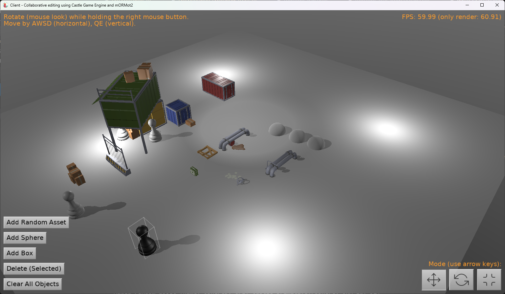
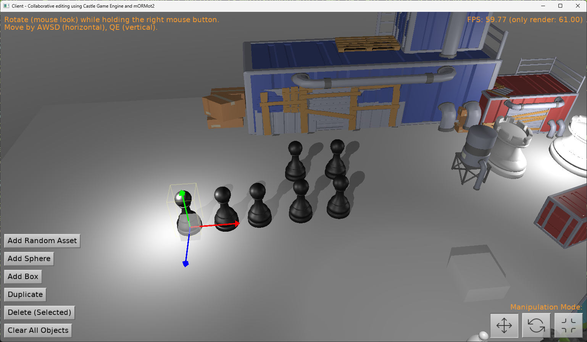

# Collaborative editing of 3D world using Castle Game Engine and mORMot2

## Introduction

A collaboration of two open-source projects, both using modern Pascal:

1. [Castle Game Engine](https://castle-engine.io/) - 3D and 2D game engine, with editor, lots of rendering features and powerful API. This provides local display and editing of the 3D world.

2. [mORMot 2](https://github.com/synopse/mORMot2/) - ORM / SOA / MVC framework. This provides the ORM -- a way to express the resulting world as objects that can be send over the the network and persisted on the server side.

In effect, you have a fun application where multiple people can connect and rearrange a 3D world. Example fun you can do:

- Design city from a buildings.
- Design a room from furniture.
- Arrange chess pieces on a board.

## Features

You can:

- Add boxes, spheres, and random glTF assets from the client data.
- Duplicate objects.
- Remove objects.
- Select, move, rotate, scale the 3D objects (using [CastleTransformManipulate](https://castle-engine.io/apidoc/html/CastleTransformManipulate.html) unit).
- Navigate in the world (use AWSD to move, hold right mouse button to look around).

The state of the 3D world is _persistent_. That is, all the operations on 3D objects (add, remove, transforming) are saved automatically. You can close the client application at any time, open it again, and the world will be in the same state as you left it. Technically:

- The client sends all the changes to the server.
- The server in turn persists the state of the 3D world to a database (Sqlite).

Note that the current camera and selection state is *not* saved, deliberately. Conceptually, they are not part of the _"3D world state"_. Also, we wanted to keep this example code simple :) But saving them could be easily addded, as additional ORM classes.

The state of world is also _synchronized with all the clients_. For example, if one client moves a given object, or adds a new object, the change appears ~instantly in all the other clients.

## Screenshots





## ORM usage

This uses ORM to synchronize the 3D world between the server and clients.

- It means that we have a class `TOrmCastleTransform` (defined in [SharedData](https://github.com/castle-engine/castle-and-mormot-collaborative-editing/blob/master/shared/shareddata.pas) unit) that represents a single 3D object in our world.

- We use mORMot to synchronize the state of this class. Client synchronizes state with server, and server synchronizes state with database (Sqlite) on disk.

- On the client side, this is also synchronized with _Castle Game Engine_ components -- one `TOrmCastleTransform` corresponds to one `TCastleTransform` (plus one child, like `TCastleScene` or `TCastleSphere` or `TCastleBox`) in the 3D world.

- ORM is a powerful approach when you want to think "I have a state of my objects, I want to synchronize it over the network". There's no need for much of application-specific server code -- the server stores the state of the objects and out-of-the-box allows the client to modify this state, by adding/updating/removing objects. So you don't need to deal with services, endpoints, JSON parsing, database reading/saving -- this is taken care of by mORMot.

- Note that this isn't the only way to use mORMot. You can also use mORMot to expose specific services (endpoints), and to implement them in any way, e.g. by database access. Just for this case, using ORM for 100% of operations made sense.

The main unit where the ORM state is visualized and manipulated is [GameViewEdit](https://github.com/castle-engine/castle-and-mormot-collaborative-editing/blob/master/castle_mormot_client/code/gameviewedit.pas).

The _mORMot_ usage in this demo follows a simple example [ex/ThirdPartyDemos/martin-doyle/02-HttpClientServerORM/](https://github.com/synopse/mORMot2/tree/master/ex/ThirdPartyDemos/martin-doyle/02-HttpClientServerORM/src). If you want to explore this approach without _Castle Game Engine_, you can start with that example.

### How do all the clients show the same world?

We synchronize all the clients with the server state, so that all clients see all the modifications done by the other clients. We have implemented this using a simple polling mechanism.

Details:

- The world that we edit and synchronize is a list of `TEditableCastleTransform` instances.

- The `TEditableCastleTransform` is a descendant of `TCastleTransform` used for displaying object in _Castle Game Engine_ (see https://castle-engine.io/viewport_and_scenes ).

- It has an additional revision number `TEditableCastleTransform.Revision`, incremented at each change. E.g. when you change the `MyTransform.Translation` by moving the object, we also increment the `MyTransform.Revision`.

All the clients just occasionally "poll" the server (ask for the current data of all `TEditableCastleTransform` instances), checking if any change occured (some transformation was added, removed, or changed).

Note: This is meant to be a *simple* solution, and not necessarily efficient. It would be more efficient to avoid the network traffic caused by polling, esp. since most of the time -> nothing changed. Ideas for improvement:

- To completely avoid polling, a 2-way communication would be nice, in which a server can notify clients about changes that occurred. But this would be more complex, it's no longer a simple REST API (in which only the client can initiate the request to server). mORMot has support for WebSockets (maybe also lower-level regular TCP/IP sockets?) so implementing such 2-way communication is surely possible, we just didn't do it in this example.

- Solutions that still use polling but in a more efficient way are also possible.

    - We could increase the frequency of polling right after a change occurred. Then gradually decrease it when no changes are detected for some time.

    - We could do the polling (with increased frequency) only for a specific transformation that changed last. This assumes that a single object is usually edited (e.g. moved, rotated) multiple times.

## Building

### Setup mORMot 2

Get [mORMot 2](https://github.com/synopse/mORMot2/). Follow the [Quick Start guide of mORMot](https://github.com/synopse/mORMot2/?tab=readme-ov-file#quick-start). In short:

```
git clone https://github.com/synopse/mORMot2/
cd static/
  wget https://synopse.info/files/mormot2static.7z
  7z x mormot2static.7z
cd ../
lazbuild packages/lazarus/mormot2.lpk
lazbuild packages/lazarus/mormot2ui.lpk
```

### Make CGE projects in this repo refer to mORMot

If you want to build using [CGE editor](https://castle-engine.io/editor) or [CGE command-line build tool](https://castle-engine.io/build_tool), then edit these 2 files:

- [castle_mormot_client/CastleEngineManifest.xml](castle_mormot_client/CastleEngineManifest.xml)
- [castle_mormot_server/CastleEngineManifest.xml](castle_mormot_server/CastleEngineManifest.xml)

In each of them, you want to fix 2 things:

1. Indicate the proper (absolute or relative) directory where mORMot2 is located. Edit the paths within `<search_paths>` in `CastleEngineManifest.xml` files.

    By default, these files assume you have `mORMot2` directory as a sibling of `castle-and-mormot-collaborative-editing` directory. If you have any other setup, you need to fix the `CastleEngineManifest.xml` files.

 2. Indicate the proper path to static files. Edit the paths within `<library_paths>` in `CastleEngineManifest.xml` files.

    By default, these files assume you build for `win64` (and, just like above, `mORMot2` and `castle-and-mormot-collaborative-editing` are siblings).

NOTE: We plan to introduce [Castle Game Engine packages](https://castle-engine.io/roadmap#packages) which will make this process easier, you should not need to edit `CastleEngineManifest.xml` files in the future.

NOTE: There's no need to edit the `CastleEngineManifest.xml` files if you build using Lazarus or Delphi IDEs -- in this case, if you followed the mORMot2 quick-start guide, you're all set.

### Compile and run CGE projects in this repo

Then both client and server can be built just like all _Castle Game Engine_ projects:

Compile by:

- [CGE editor](https://castle-engine.io/editor). Open each project (`castle_mormot_client` and `castle_mormot_server`). And use menu items _"Compile"_ or _"Compile And Run"_.

- Or use [CGE command-line build tool](https://castle-engine.io/build_tool). Run `castle-engine compile` in the subdirectory of each project, `castle_mormot_client` or `castle_mormot_server`.

- Or use [Lazarus](https://www.lazarus-ide.org/). Open in Lazarus `castle_mormot_client.lpi` (or `castle_mormot_server.lpi`) file and compile / run from Lazarus. Make sure to first register [CGE Lazarus packages](https://castle-engine.io/lazarus).

- Or use [Delphi](https://www.embarcadero.com/products/Delphi). Open in Delphi `castle_mormot_client.dproj` (or `castle_mormot_server.dproj`) file and compile / run from Delphi. See [CGE and Delphi](https://castle-engine.io/delphi) documentation for details.

## TODO

- For collaborative editing, actually watch for changes from others done to the world. This is not implemented yet, we only synchronize from server at Start.
- Allow choosing specific asset to add (TCastleComboBox), not random.

## Authors and license

Copyright 2024-2025 by Michalis Kamburelis.

Licence: permissive 3-clause BSD license. Basically do what you want, just keep the copyright notice.
